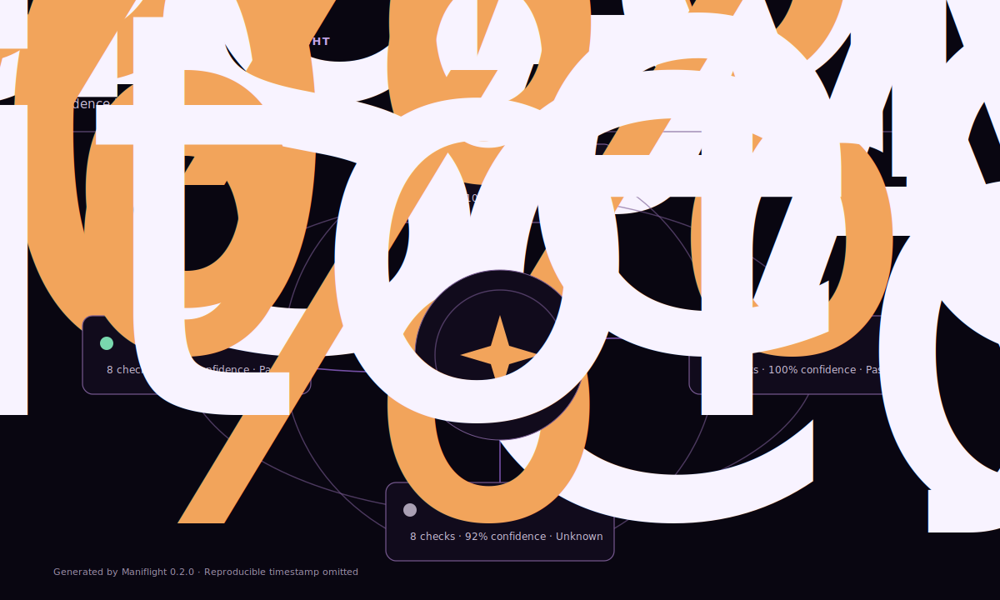

# Maniflight

**Repository preflight that shows its evidence.**

Maniflight is a read-only repository preflight CLI and GitHub Action. It
inspects architecture, automation, security hygiene, and community readiness,
then produces a machine-readable record and a self-contained interactive
orbital report.

[](https://agrovr.github.io/maniflight/)

**[Explore the live interactive self-scan →](https://agrovr.github.io/maniflight/)**

The score is a navigation aid, not a certification. Every finding identifies
the rule, outcome, evidence, and remediation, while evidence Maniflight cannot
reliably observe is marked unknown instead of becoming a silent pass or fail.

> **v0.1 status:** early public preview. The current release is a
> general-purpose repository scanner. AI-service and Kubernetes readiness
> packs are future, opt-in roadmap work and are not claimed as current
> features.

## What v0.1 does

- Scans a local repository without modifying it.
- Applies deterministic rules across four evidence domains.
- Uses optional repository-scoped GitHub metadata when a token is provided.
- Writes `report.json`, `report.html`, and `orbit.svg` to the selected
  output directory.
- Presents findings in an accessible report with source-linked evidence,
  keyboard navigation, light and dark themes, print styles, and reduced-motion
  support.
- Can run locally or as a pull-request/branch GitHub Action.

Maniflight does not execute inspected repository code, apply fixes, rank
contributors, replace a security scanner, or prove production readiness.

## Quick start from source

Requirements:

- Node.js 22 or newer;
- npm; and
- Git.

```bash
git clone https://github.com/agrovr/maniflight.git
cd maniflight
npm ci
npm run build
npm run scan -- . --output maniflight-report
```

Open `maniflight-report/report.html` in a browser. The same directory contains
the JSON record and standalone orbital SVG.

The package is not currently advertised as an npm registry install. Clone and
build the repository rather than relying on an unverified `npx` package.

### CLI options

The source command expands to `maniflight scan [path]`. Its focused options
are:

| Option | Purpose |
| --- | --- |
| `-o, --output <directory>` | Select the report directory. Defaults to `maniflight-report`. |
| `-r, --repository <owner/name>` | Request optional read-only GitHub metadata for a repository. |
| `-c, --config <path>` | Select a configuration file inside the inspected repository. |
| `--offline` | Skip GitHub API enrichment even when environment metadata is available. |
| `--fail-under <score>` | Exit unsuccessfully when the overall score is below an owner-selected threshold. |
| `--fail-on-high` | Exit unsuccessfully when an unwaived high-severity finding remains. |

When enrichment is requested, the CLI can read `GITHUB_TOKEN` and
`GITHUB_REPOSITORY` from the environment. Do not place a token in the command
line or configuration file.

## GitHub Action

The public Action reference becomes available after the `v0` release is
published. A minimal workflow is:

```yaml
name: Repository preflight

on:
  pull_request:
  push:
    branches: [main]

permissions:
  contents: read

jobs:
  maniflight:
    runs-on: ubuntu-latest
    timeout-minutes: 10
    steps:
      - name: Check out repository
        uses: actions/checkout@9c091bb21b7c1c1d1991bb908d89e4e9dddfe3e0 # v7.0.0

      - name: Run Maniflight
        id: maniflight
        uses: agrovr/maniflight@v0
        with:
          path: .
          output-dir: maniflight-report
          github-token: ${{ github.token }}
          repository: ${{ github.repository }}
```

For production workflows, pin Maniflight to a reviewed full commit SHA instead
of a moving major tag. Keep the workflow token read-only unless a future,
documented feature requires another permission.

### Action inputs

| Input | Default | Purpose |
| --- | --- | --- |
| `path` | `.` | Repository path to inspect. |
| `output-dir` | `maniflight-report` | Directory for the HTML, JSON, and SVG reports. |
| `github-token` | unset | Optional repository-scoped token for read-only GitHub metadata. |
| `repository` | current Actions repository | Repository in `owner/name` form. |
| `config` | `.maniflight.yml` | Optional configuration path. |
| `fail-under` | unset | Optional overall-score gate selected by the repository owner. |
| `fail-on-high` | `false` | Optionally fail when a high-severity finding exists. |

Gates are opt-in because a new or partially observable repository should not
fail from an unexplained default policy.

### Action outputs

| Output | Meaning |
| --- | --- |
| `overall-score` | Overall score from 0–100 when enough evidence is available. |
| `confidence` | Percentage of weighted checks supported by usable evidence. |
| `high-findings` | Count of high-severity findings. |
| `report-path` | Path to the standalone HTML report. |
| `json-path` | Path to the machine-readable JSON report. |

Upload the report as an artifact in your own workflow if it needs to persist
after the job. Maniflight does not publish repository data to a hosted service.

## Evidence domains

| Domain | What it asks |
| --- | --- |
| Architecture | Can the project structure, entry points, source boundaries, type posture, and test capability be understood? |
| Automation | Is repeatable validation present, bounded, and separated from unsafe deployment behavior? |
| Security | Are baseline policy, dependency, workflow-permission, reference-pinning, and sensitive-file safeguards visible? |
| Community | Can another person understand, use, support, and contribute to the project responsibly? |

The complete v0.1 catalog and its limitations are documented in
[docs/RULES.md](docs/RULES.md).

## Scoring and confidence

Rule outcomes are `pass`, `warn`, `fail`, `unknown`, or
`not_applicable`. A warning earns partial credit; unknown and not-applicable
outcomes do not become failures. Missing evidence reduces confidence so that a
high score based on a narrow observation surface is visibly different from a
well-supported result.

See [docs/SCORING.md](docs/SCORING.md) for the formula, severity model, examples,
and guidance on responsible gating.

## Configuration

Maniflight looks for `.maniflight.yml` by default, or a different file passed
through the Action's `config` input. Configuration is optional for the v0.1
baseline. Because the format is pre-1.0, review release notes before carrying a
configuration across preview releases.

```yaml
version: 1

exclude:
  - fixtures/generated/**

limits:
  maxFiles: 25000
  maxFileBytes: 1048576
  maxParsedBytes: 20971520

github:
  enabled: true

thresholds:
  failUnder: null
  failOnHigh: false

ignore:
  - rule: automation/deploy-safety
    paths:
      - .github/workflows/release.yml
    reason: Deployment approval is enforced by a separately reviewed reusable workflow.
```

`exclude` accepts repository-relative patterns. `limits` bounds collection
work, and `github.enabled` can disable API enrichment. Thresholds remain
opt-in. An `ignore` entry records an explicit waiver: the finding stays visible
and keeps its scoring effect, while a matching waived finding is excluded from
the `fail-on-high` count. Omit `paths` to waive the rule repository-wide.

Configuration changes must not grant Maniflight permission to execute target
code or mutate the inspected repository.

## How a scan works

```text
repository files + optional read-only GitHub metadata
                         │
                         ▼
               deterministic evidence
                         │
                         ▼
              rules + status + severity
                         │
                         ▼
            score + confidence + findings
                         │
                         ▼
        report.json + report.html + orbit.svg
```

The JSON report is the automation contract. The HTML and SVG views make that
same evidence easier to navigate; they do not invent additional findings.

## Develop and verify

```bash
npm ci
npm run check
npm test
npm run build
npm run scan -- . --output maniflight-report
```

Read [CONTRIBUTING.md](CONTRIBUTING.md) before proposing a rule or scoring
change. Rule changes require fixtures, false-positive analysis, remediation,
and matching documentation.

## Project boundaries and roadmap

The [roadmap](ROADMAP.md) tracks evidence comparison, monorepo improvements,
configuration maturity, and future opt-in AI/Kubernetes readiness packs.
Maniflight deliberately avoids contributor scoring, automatic repair, and
unqualified security or compliance claims.

## Community and security

- Questions and support scope: [SUPPORT.md](SUPPORT.md)
- Contributions: [CONTRIBUTING.md](CONTRIBUTING.md)
- Conduct: [CODE_OF_CONDUCT.md](CODE_OF_CONDUCT.md)
- Vulnerability reporting: [SECURITY.md](SECURITY.md)

## License

Maniflight is available under the [MIT License](LICENSE).
