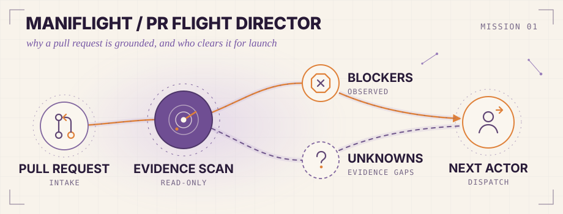
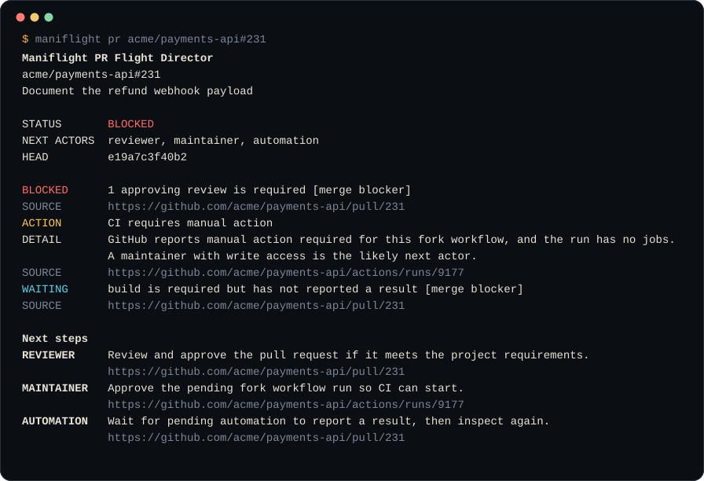

<p align="center">
  <a href="https://agrovr.github.io/maniflight/">
    <picture>
      <source media="(prefers-color-scheme: dark)" srcset="docs/assets/maniflight-mission-dark.svg">
      <source media="(prefers-color-scheme: light)" srcset="docs/assets/maniflight-mission-light.svg">
      
    </picture>
  </a>
</p>

<h1 align="center">Maniflight</h1>

<p align="center">
  <strong>Why is this pull request blocked, and who has to move next?</strong><br>
  Read-only GitHub diagnostics that separate real merge blockers from missing evidence.
</p>

<p align="center">
  <a href="https://github.com/agrovr/maniflight/releases/latest"></a>
  <a href="https://github.com/agrovr/maniflight/actions/workflows/ci.yml"></a>
  
  <a href="LICENSE"></a>
</p>

<p align="center">
  <a href="https://agrovr.github.io/maniflight/"><strong>Website</strong></a> ·
  <a href="docs/PR-FLIGHT.md">PR Flight guide</a> ·
  <a href="https://agrovr.github.io/maniflight/scan/">Live self-scan</a> ·
  <a href="docs/STABILITY.md">Stability</a>
</p>

## Quickstart

Install the release package from GitHub:

```bash
npm install --global https://github.com/agrovr/maniflight/releases/download/v1.0.0/maniflight-1.0.0.tgz
```

Point it at any pull request:

```bash
maniflight pr owner/repository#123
```

<p align="center">
  
</p>

<sub>Sample output for a fictional pull request, generated by Maniflight's own renderer.</sub>

Set `GH_TOKEN` or `GITHUB_TOKEN` for complete evidence. Tokens are read from the environment only
and are never accepted as arguments. Add `--json` for one schema-versioned document, or
`--no-color` for plain output (`NO_COLOR` is honored too).

## What it answers

| Question | How Maniflight answers it |
| :-- | :-- |
| **Can this merge?** | Mergeable, blocked, waiting, or incomplete, from the PR, GraphQL merge state, and active branch rules. |
| **What is in the way?** | Required approvals, requested changes, unresolved threads, checks, commit statuses, and hidden `action_required` workflow runs. |
| **What can't it see?** | Missing or inaccessible evidence is listed under **Evidence gaps** as `unknown`, never as a guessed pass. |
| **Who moves next?** | A **Next steps** list per actor (contributor, reviewer, maintainer, automation) with a link to the evidence. |

See the [PR Flight Director guide](docs/PR-FLIGHT.md) for every source, status, and known limit.

## Repository scan

Maniflight can also inspect repository readiness without executing project code:

```bash
maniflight scan . --output maniflight-report
```

It writes JSON plus an accessible standalone HTML report, and ships as a GitHub Action with optional
gates. The [repository scan guide](docs/REPOSITORY-SCAN.md) covers configuration and baselines, and
[Maniflight's own self-scan](https://agrovr.github.io/maniflight/scan/) is rebuilt on every push.

## Trust

- GitHub access is read-only: no comments, approvals, reruns, merges, or log downloads.
- Reports link to observable evidence and record the observation time and exact head SHA.
- Remote text and URLs are sanitized and bounded before output, including terminal control codes.
- A result is diagnostic evidence, not a security or compliance certification.

Read the [stability policy](docs/STABILITY.md), [changelog](CHANGELOG.md), [support guide](SUPPORT.md),
or [security policy](SECURITY.md). Contributions follow [CONTRIBUTING.md](CONTRIBUTING.md).

MIT licensed.
