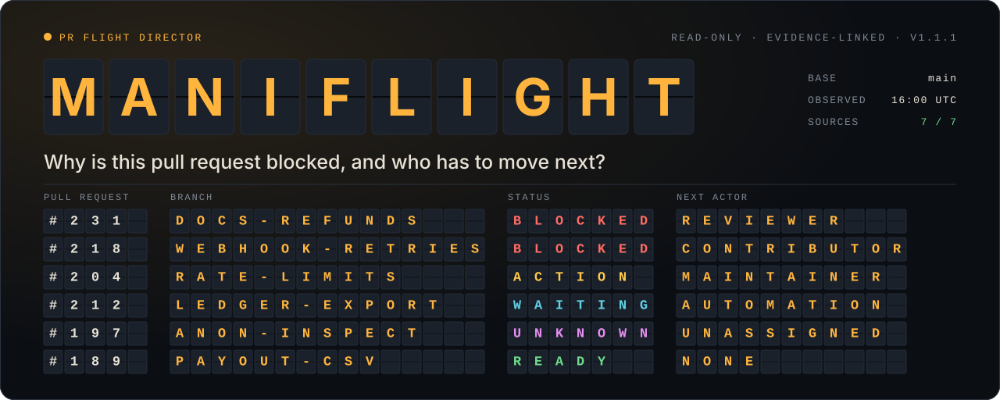
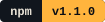
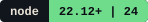
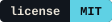
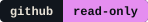
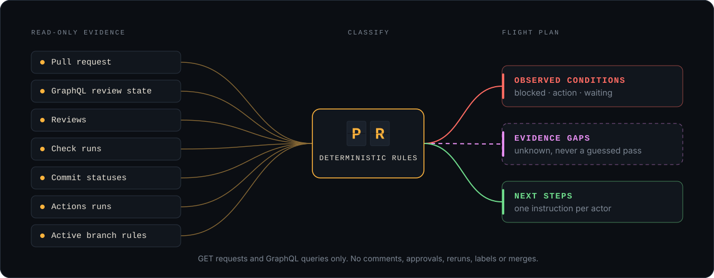

<a href="https://agrovr.github.io/maniflight/">
  
</a>

<p align="center">
  <a href="https://github.com/agrovr/maniflight/actions/workflows/ci.yml"></a>
  <a href="https://github.com/agrovr/maniflight/releases/latest"></a>
  
  <a href="LICENSE"></a>
  <a href="#trust-and-safety"></a>
</p>

<p align="center">
  <a href="https://agrovr.github.io/maniflight/"><b>Website</b></a>
  &nbsp;·&nbsp;
  <a href="docs/PR-FLIGHT.md">PR Flight guide</a>
  &nbsp;·&nbsp;
  <a href="docs/REPOSITORY-SCAN.md">Scan guide</a>
  &nbsp;·&nbsp;
  <a href="https://agrovr.github.io/maniflight/scan/">Live self-scan</a>
  &nbsp;·&nbsp;
  <a href="CHANGELOG.md">Changelog</a>
</p>

---

**Maniflight** is a read-only command-line tool that explains why a GitHub pull request can't merge
yet. GitHub scatters that answer across reviews, checks, commit statuses, hidden Actions runs, and
branch rules. Maniflight reads all of them, separates what it **observed** from what it **couldn't
see**, and tells each person what to do next, with a link to the evidence.

It never comments, approves, reruns, or merges, and it never runs code from the repository it
inspects.

<p align="center">
  
</p>

<p align="center"><sub>Sample output for a fictional pull request, generated by Maniflight's own renderer on every build.</sub></p>

## Contents

- [Features](#features)
- [Install](#install)
- [Usage](#usage)
  - [Inspect a pull request](#inspect-a-pull-request)
  - [Authentication](#authentication)
  - [JSON output](#json-output)
  - [Scan a repository](#scan-a-repository)
  - [GitHub Action](#github-action)
  - [Configuration](#configuration)
- [How it works](#how-it-works)
- [Exit codes](#exit-codes)
- [Trust and safety](#trust-and-safety)
- [Compatibility and stability](#compatibility-and-stability)
- [Contributing](#contributing)
- [License](#license)

## Features

| | |
| :-- | :-- |
| **PR Flight Director** | `maniflight pr` combines seven GitHub sources into one status, the blockers behind it, and a next step for each actor. |
| **Evidence gaps, not guesses** | Anything GitHub hides from your token is listed under *Evidence gaps* as `unknown`, never reported as a pass. |
| **Next steps per actor** | Contributor, reviewer, maintainer, or automation, each with one concrete instruction and an evidence link. |
| **Hidden blockers surfaced** | Fork workflows parked at `action_required` with zero jobs, required contexts that never reported, unresolved threads. |
| **Terminal and JSON** | Readable, colored terminal output, or one schema-versioned JSON document for scripts and bots. |
| **Repository scan** | `maniflight scan` grades architecture, automation, security hygiene, and community health, with an accessible HTML report. |
| **GitHub Action** | Run the scan in CI with optional score, severity, and regression gates. |

## Install

Maniflight is distributed as a GitHub release archive. It needs Node.js 22.12+ (22.x) or Node.js 24
on Windows, macOS, or Linux.

```bash
npm install --global https://github.com/agrovr/maniflight/releases/download/v1.0.0/maniflight-1.0.0.tgz
maniflight --version
```

<details>
<summary><b>Build from source</b></summary>

<br>

```bash
git clone https://github.com/agrovr/maniflight.git
cd maniflight
npm ci
npm run build
node dist/cli.js --help
```

</details>

> [!NOTE]
> Maniflight is not published to the npm registry yet, so `npx maniflight` is not a supported way to
> run it. Install from the release archive above.

## Usage

### Inspect a pull request

```bash
maniflight pr owner/repository#123
```

The report starts with the overall status and next actors, lists observed conditions (blocked,
action, waiting), then **Evidence gaps** for anything reported as unknown, and ends with **Next
steps**. Each line that came from GitHub links to its source.

| Option | Purpose |
| :-- | :-- |
| `--json` | Write one schema-versioned JSON document instead of terminal text. |
| `--no-color` | Plain output. `NO_COLOR` is honored, and `FORCE_COLOR` enables color for pipes. |

### Authentication

Maniflight reads `GH_TOKEN`, then `GITHUB_TOKEN`. Tokens are environment-only and are never accepted
as arguments or written to a report.

```bash
export GH_TOKEN="$(gh auth token)"   # or a fine-grained token with read access
maniflight pr owner/repository#123
```

Without a token, public pull requests still work, but GitHub's GraphQL API requires authentication,
so review decisions and review threads appear under *Evidence gaps*.

### JSON output

```bash
maniflight pr owner/repository#123 --json > flight.json
```

<details>
<summary><b>Example document</b> (trimmed)</summary>

<br>

```json
{
  "kind": "pull-request-flight",
  "schemaVersion": "1.0",
  "outcome": {
    "status": "blocked",
    "nextActors": ["reviewer", "maintainer", "automation"],
    "summary": "One or more observed conditions currently block the pull request."
  },
  "counts": { "blocked": 1, "actionRequired": 1, "waiting": 1, "unknown": 0 },
  "nextActions": [
    {
      "actor": "maintainer",
      "summary": "Approve the pending fork workflow run so CI can start.",
      "url": "https://github.com/acme/payments-api/actions/runs/9177"
    }
  ]
}
```

The full document also includes the pull request snapshot, every signal with its evidence links,
and per-source coverage. See the [PR Flight guide](docs/PR-FLIGHT.md#output) for the contract.

</details>

### Scan a repository

```bash
maniflight scan . --output maniflight-report
```

Writes `report.json`, an accessible standalone `report.html`, and an `orbit.svg` overview, without
executing the project's code. Compare against an earlier run with `--baseline-report`, and opt into
gates with `--fail-under`, `--fail-on-high`, or `--fail-on-regression`.
[See Maniflight's own report](https://agrovr.github.io/maniflight/scan/).

### GitHub Action

```yaml
name: Repository diagnostics

on:
  pull_request:

permissions:
  contents: read

jobs:
  maniflight:
    runs-on: ubuntu-latest
    steps:
      - uses: actions/checkout@9c091bb21b7c1c1d1991bb908d89e4e9dddfe3e0 # v7.0.0
      - uses: agrovr/maniflight@v1
        with:
          github-token: ${{ github.token }}
          fail-on-regression: true
          baseline-report: baseline/report.json
```

<details>
<summary><b>All inputs and outputs</b></summary>

<br>

| Input | Default | Purpose |
| :-- | :-- | :-- |
| `path` | `.` | Repository path to inspect. |
| `output-dir` | `maniflight-report` | Directory for report artifacts. |
| `github-token` | | Optional token for read-only GitHub metadata. |
| `repository` | current repository | Repository in `owner/name` form. |
| `config` | `.maniflight.yml` | Configuration file path. |
| `baseline-report` | | Earlier `report.json` for regression comparison. |
| `fail-under` | | Fail below this readiness score. |
| `fail-on-high` | `false` | Fail when a high-severity finding is present. |
| `fail-on-regression` | `false` | Fail only when the scan regresses from the baseline. |

| Output | Description |
| :-- | :-- |
| `overall-score` | Readiness score from 0 to 100. |
| `confidence` | Share of weighted checks with usable evidence. |
| `high-findings` | Number of high-severity findings. |
| `report-path` / `json-path` | Paths to the HTML and JSON reports. |
| `regressions` / `comparison-path` | Regression count and `comparison.json` path, with a baseline. |

For security-sensitive workflows, pin the Action to a reviewed full commit SHA.
[action.yml](action.yml) is the authoritative contract.

</details>

### Configuration

The scan reads an optional `.maniflight.yml` from the repository root:

```yaml
version: 1

exclude:
  - demo/**
  - tests/fixtures/**

thresholds:
  failUnder: 80     # null to disable
  failOnHigh: false

ignore:             # waive a rule, optionally for specific paths
  - rule: community/repository-metadata
    reason: Topics are managed by the organization, not this repository.
```

The [rule catalog](docs/RULES.md) lists every rule ID, and [scoring](docs/SCORING.md) explains how
status, weight, and confidence combine.

## How it works

<p align="center">
  
</p>

No single GitHub response explains a stuck pull request. Maniflight collects each source with
read-only requests, records whether it was `available`, `partial`, `unavailable`, or `not_attempted`,
and classifies every condition with deterministic rules:

| Status | Meaning |
| :-- | :-- |
| `BLOCKED` | Evidence identifies a current merge blocker. |
| `ACTION` | A person must act before progress can continue. |
| `WAITING` | Automation or another pending condition is not complete. |
| `UNKNOWN` | The available evidence cannot support a stronger conclusion. |
| `PASS` | The observed condition completed successfully. |
| `INFO` | Relevant, but not known to block the merge. |

Next actors are inferred only when the evidence supports it. An action with no reliable owner is
shown as `UNASSIGNED` rather than guessed.

## Exit codes

| Command | `0` | `1` |
| :-- | :-- | :-- |
| `maniflight pr` | A report was produced, **including a blocked PR**. | Invalid input or the pull request could not be fetched. |
| `maniflight scan` | A report was produced and no enabled gate triggered. | An execution error, or an enabled gate triggered (the report is still written). |

## Trust and safety

- **Read-only.** GitHub GET requests and GraphQL queries only: no comments, approvals, reruns,
  labels, merges, or workflow dispatches.
- **No code execution.** No checkout, log, or artifact downloads from the inspected repository.
- **Evidence-linked.** Every report records the observation time and exact head SHA, and conclusions
  link to their source.
- **Sanitized.** Remote titles, names, and URLs are bounded, and terminal control characters are
  stripped. Color is applied only to Maniflight's own labels.
- **Token-safe.** Tokens come from the environment and are never serialized.

A result is diagnostic evidence, not a security or compliance certification. To report a
vulnerability, follow the [security policy](SECURITY.md).

## Compatibility and stability

Maniflight 1.x treats the `pr` and `scan` commands, their documented options and exit behavior, the
`pull-request-flight` JSON `schemaVersion: "1.0"`, repository report schemas, and the Action's inputs
and outputs as stable. Additive changes ship in minor releases; anything breaking waits for a major
release. GitHub.com is supported; GitHub Enterprise Server is not part of the 1.x contract.

Read the [stability policy](docs/STABILITY.md) and the [roadmap](ROADMAP.md).

## Contributing

Bug reports, rule proposals, and pull requests are welcome. Start with
[CONTRIBUTING.md](CONTRIBUTING.md), then:

```bash
npm ci
npm run check   # lint and types
npm test
npm run demo    # regenerates the demo report and this README's artwork
```

Questions go through the [support guide](SUPPORT.md). Everyone is expected to follow the
[code of conduct](CODE_OF_CONDUCT.md).

## License

[MIT](LICENSE) © Ashmit Grover
